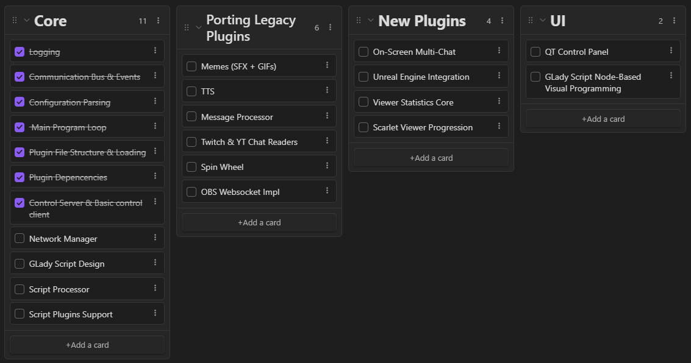
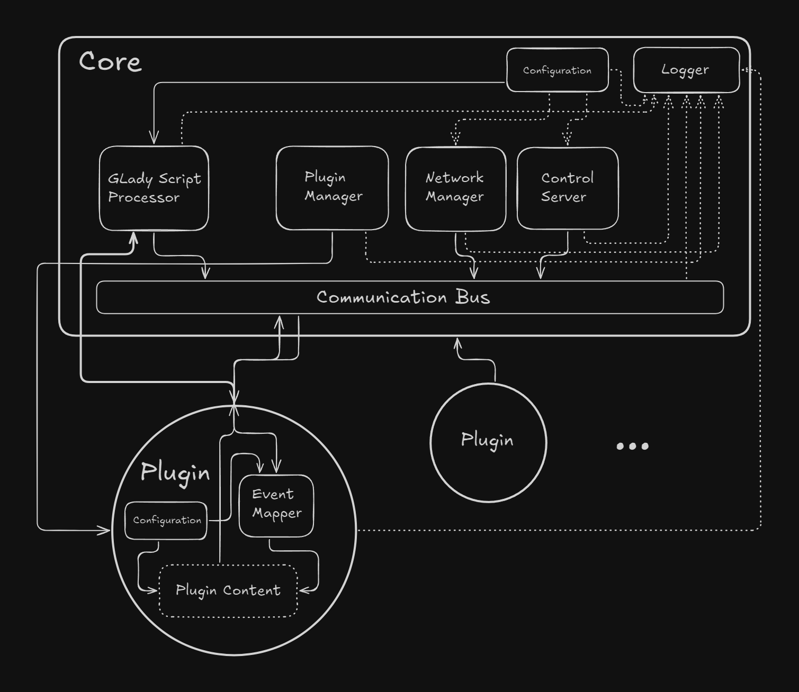

### Idea

GLady is a system, designed to make live streams more entertaining by introducing various interactive elements, available to viewers.

In the future, GLady will also be capable of analyzing your streams, remembering key moments and generating stream recaps.

It is a python-based application, supporting network communication with other instances of itself, allowing for seamless multi-computer setups. 

[Roadmap](../Roadmap.md)

### Design Policy

GLady incorporates fully modular plugin-based design where every element can be customized to suit a specific need.

### Architecture

#### Core:
* [Communication Bus](Communication%20Bus.md)
* [Plugin Manager](Plugin%20Manager.md)
* [Control Server](Control%20Server.md)
* [Network Manager](Network%20Manager.md)
* [Configuration](Configuration.md)
* [Logger](Logger.md)
* [GLady Script](GLady%20Script.md)

