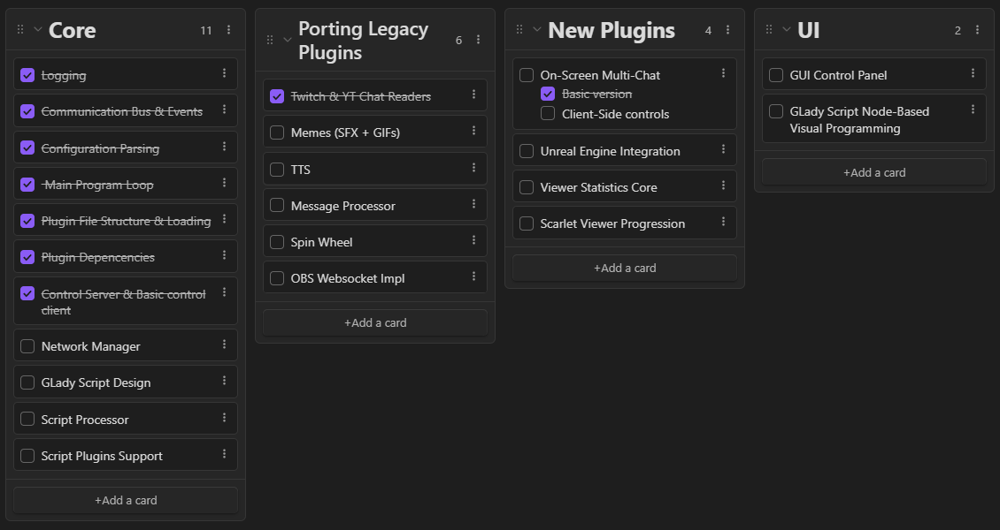
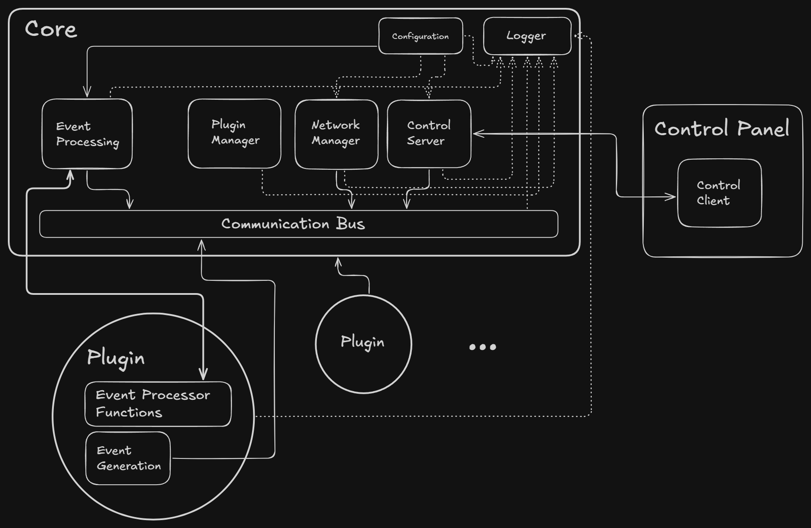

### Idea

GLady is a fully modular, highly customizable and locally-run system, designed to make live streams more entertaining by introducing various interactive elements available to viewers through chat commands.

It is a python-based application, supporting network communication with other instances of itself, allowing for seamless multi-computer setups (not in current version). 

### Design Policy

GLady incorporates fully modular plugin-based design where every element can be customized to suit a specific need.

### Architecture

#### Core:
* [Communication Bus](Communication%20Bus.md)
* [Plugin Manager](Plugin%20Manager.md)
* [Control Server](Control%20Server.md)
* [Network Manager](Network%20Manager.md)
* [Configuration](Configuration.md)
* [Logger](Logger.md)

