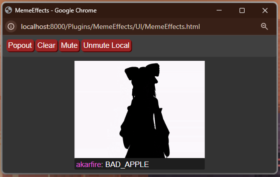

# Setup Guide

At this point GLady has no graphical user interface for configuration, so the process might be tricky, but it can be mostly avoided if you use default configuration. In this guide I will describe how to easily setup GLady and pair her with OBS Studio for:

* On-screen multi-chat for Youtube and Twitch (or any of them separately);
* Text To Speech message commands;
* Meme Effects message commands for showing funny pictures and playing funny sounds ;)

*Note 1: This guide assumes you have completed Installation guide from the README page/file and ran GLady at least once*.

*Note 2: Advanced configuration is not present in this guide, final setup will use default configuration bundled with the GLady files.*

---
### Step 1: Setup Chat Reading Plugins
GLady comes bundled with 2 live stream chat reading plugins: `TwitchChatReader` and `YouTubeChatReader`, that read Twitch and YT chats in real time. 

If you only need one of them, then you can disable the one you don't need by going to `GLady/Plugins/<PluginName>/plugin_info.txt` and changing `enabled = True` to `enabled = False`.

#### 1.1 Setting up Twitch Chat Reader
`TwitchChatReader` requires a relatively complicated but a one-time setup. For it you will have to create a twitch bot account and put it's authentication data into `GLady/Private/Auth/TwitchAuthData.txt`.

* `nickname` - twitch nickname of the bot;
* `token` - authentication token of the bot;
* `channel` - name of the channel it will be reading chat from (your twitch channel name, example: `#akarfire`).

#### 1.2 Setting up YouTube Chat Reader
To setup `YouTubeChatReader` you simply need to paste a link to your YT stream into `GLady/Private/YT_StreamLink.txt`. Replace all contents of this file with your YT link. This setup must be done before every stream (since every new stream has a different link).

To obtain the link copy it from the URL field in your browser, "share" links might not work. Also I recommend copying the link either from Chrome or Firefox, Microsoft edge's links didn't work consistently for me.

---
### Step 2: Text To Speech, Meme Effects and On Screen Chat

Both TTS and Meme Effects are implemented as small web applications. To use any of them you need to first start GLady (by running `RunGlady.bat`) and then go to 

* `http://localhost:8000/Plugins/TextToSpeech/UI/TextToSpeech.html` - for TTS;
* `http://localhost:8000/Plugins/MemeEffects/UI/MemeEffects.html` - for Meme Effects.

*NOTE: These links only work while GLady is running.*

All instances of TTS, Meme Effects and On Screen Chat which are connected to one instance of GLady are synchronized. For example pressing *Mute* button on one instance of TTS will mute every instance of it (for muting individual instances use *Mute Local* button).

**On Screen Chat** can be opened trough `http://localhost:8000/...`, but I recommend opening it simply as a file: use something like `file:///D:/Projects/GLady/Plugins/OnScreenChat/UI/OnScreenChat.html` as a link.

#### 2.1 Text To Speech


To setup a TTS avatar you need to put two files into `GLady/Resources/TTS` and name them `TTS_Silent.png` and `TTS_Speak.png`. If you wish to use different file names/extensions, you can change required file names in `GLady/Config/Plugins/TextToSpeech/Options.txt`.

You can find example images in `GLady/GLadyDocumentation/Images`.

#### 2.2 Meme Effects



To setup Meme Effects you need to populate `GLady/Resources/MemeEffects` with meme images and sound effects. Supported types are:
* `.gif`, `.png`, `.jpeg`, `.webp` - for images;
* `.mp3`, `.wav` - for sound effects.

Files names must be upper case with `_` as spaces. Image file name must match sound effect file name. These file names will be used as Meme identifiers (Meme Names).


You can edit `GLady/Config/Plugins/MemeEffects/Options.txt` by adding custom volume options, that can adjust volume of any meme sound effect. Such options must follow the following convention:
`<MEME_NAME>_Volume = <Volume Scale value, 1.0 - default>`.

#### 2.3 On Screen Chat
On Screen chat does not require any specific setup.

---
### Step 3: Setup Commands
Viewer commands are controlled by `SimpleMessageCommands` plugin. All commands are listed inside `GLady/Config/Plugins/SimpleMessageCommands/Commands.txt` in the following format:

`COMMAND_NAME_1, COMMAND_NAME_2 -> EventName("ParameterName_1" : "ParameterValue_1")`.

Commands can have multiple names (as many as you need). Every name can be used to call command - any message, fetched by chat readers, will be scanned for `!COMMAND_NAME!` type calls. If such call is located, a corresponding command is run (if present).

Without going into advanced configuration you shall comment out (put `#` in the beginning of a line) or remove lines with command you don't need. I recommend leaving (and editing) the following:

```
# TTS Commands
VOICE, SAY, TTS -> TextToSpeech
DEEP_FRIED_VOICE, DEEP_FRIED, DEEPFRIED, DEEPFRIEDVOICE -> TextToSpeech("AudioEffects" : "[Gain(gain_db=20)]", "Volume" : 0.1)
DEEP_FRIED_RICE, DEEPFRIEDRICE -> TextToSpeech("AudioEffects" : "[Gain(gain_db=20), PitchShift(semitones=3), ]", "Volume" : 0.1)
CHORUS -> TextToSpeech("AudioEffects" : "[Chorus()]")
REVERB -> TextToSpeech("AudioEffects" : "[Reverb(room_size=0.25)]")

VOICE_AR, VOICEAR -> TextToSpeech("Language" : "ar")
# Add other languages to your liking

# Name Coloring
NAME_RED, NAMERED -> ChangeNameColor("Color" : "'rgb(255, 21, 0)'")
NAME_GREEN, NAMEGREEN -> ChangeNameColor("Color" : "'rgb(121, 249, 41)'")
NAME_ORANGE, NAMEORANGE -> ChangeNameColor("Color" : "'rgb(249, 124, 41)'")
NAME_YELLOW, NAMEYELLOW -> ChangeNameColor("Color" : "'rgb(249, 200, 41)'")
NAME_BLUE, NAMEBLUE -> ChangeNameColor("Color" : "'rgb(41, 131, 249)'")
NAME_PURPLE, NAMEPURPLE -> ChangeNameColor("Color" : "'rgb(176, 41, 249)'")
NAME_PINK, NAMEPINK -> ChangeNameColor("Color" : "'rgb(254, 14, 202)'")
NAME_RANDOM, NAMERANDOM -> ChangeNameColor("Color" : "'Random'")

# Meme Commands
<YOUR_MEME_COMMAND_1>, ... -> MemeCommand("MemeName" : "<YOUR_MEME_NAME>")
...
# Add all your memes in the same way as shown above
...
```

*Note: when a chat message "!cool command!" is received, it is interpreted the same way as "!COOL_COMMAND!" would be."*

---
### Step 4: OBS Setup

#### 4.1 Browser Sources
To add On Screen Chat, TTS and Meme Effects to your stream you need to create 3 *Browser* sources (one for each element). In OBS you should use the `_Strip` versions of the files - they have all of visual control elements removed to reduce on-screen clutter.
##### 4.1.1 On Screen Chat
For On Screen Chat name browser source `GLady_OnScreenChat` and set it up like this:


Custom CSS (for copying):
```css
.main_body { background-color: rgba(0, 0, 0, 0);}
```

##### 4.1.2 Meme Effects
Its important that you name the meme effects browser source `GLady_MemeEffects` (for automatic refreshing on GLady launch, assuming you have configured OBS WebSocket plugin - see *4.2*).


Custom CSS (for copying):
```css
.main_body { background-color: rgba(0, 0, 0, 0);}
```

##### 4.1.3 Text To Speech
Its important that you name the text to speech browser source `GLady_TTS` (for automatic refreshing on GLady launch, assuming you have configured OBS WebSocket plugin - see *4.2*).


Custom CSS (for copying):
```css
.main_body { background-color: rgba(0, 0, 0, 0);}
.subtitle {zoom: 350%;}
```
You can change the percentage of `zoom` in the `css` snippet to your liking.

#### 4.2 OBS WebSocket Setup
`ObsWebsocket` plugin allows GLady to control some parts of your OBS Studio app (mainly its for showing and hiding sources). We will not be using that functionality for any on-stream effects, instead we will only use it for automatic refresh of browser sources on GLady startup. Without it, you have to either always start GLady before launching OBS or manually refresh Meme Effects and TTS browser sources after launching GLady.

To setup OBS WebSocket plugin you need to open OBS Studio and go to *Tools ->WebSocket Server Settings:*


Then make sure *Enable WebSocket server* is checked


After that click *Generate Password* (if you haven't generated it previously for setup with other apps) and click *Show Connect Info*.


Now you need to copy authentication info from OBS Studio to `GLady/Private/Auth/ObsAuthData.txt`. If you are running GLady on the same machine as OBS Studio, then I recommend to leave `ip: localhost` as is.

---
### General Recommendations

When using GLady during the stream I recommend *Popping Out* On Screen Chat, Meme Effects and TTS (NOT `_Strip` versions) from your browser and putting them onto your second monitor or into *always on top* mode using power toys. This way you have access to the multi-chat (read only) and an ability to mute TTS and Meme Effects any moment you'd like.

*Example of screen setup on an ultrawide monitor.*
